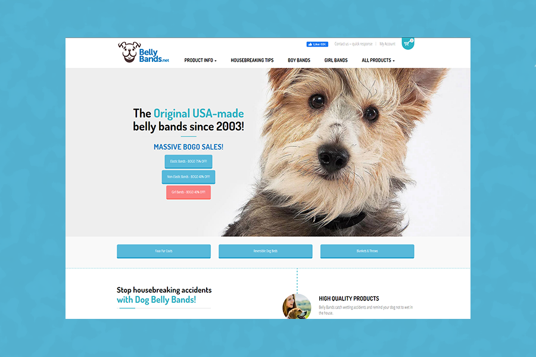
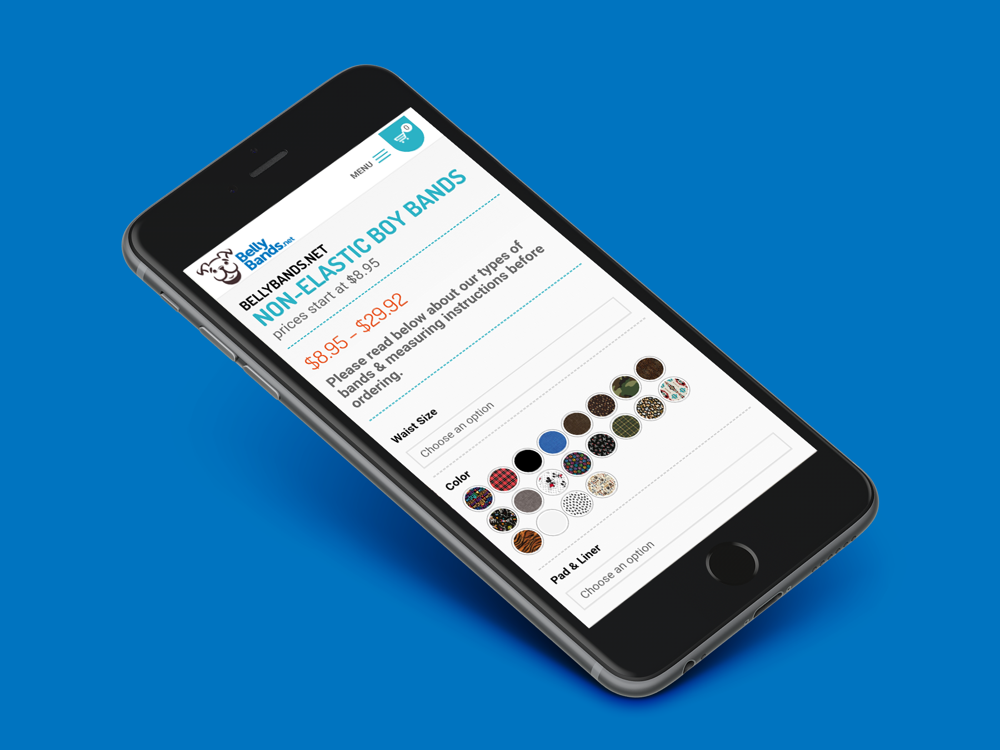
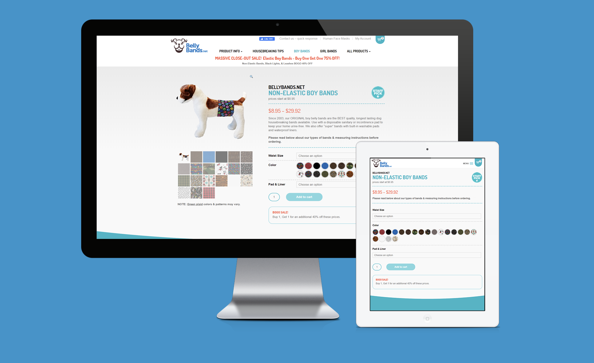

### About Job

Ongoing database and website maintenance of an E-commerce company that offers over a thousand variations of products for purchase. Maintaining website speed has been the ongoing challenge of this job, although the most challenging aspect was overhauling the design to be more mobile-friendly while not alienating the customer base that was used to the inherited design--which was over a decade old.

### Technical Demands

<ul>
    <li>Javascript</li>
    <li>HTML 5</li>
    <li>Wordpress</li>
    <li>WooCommerce</li>
    <li>Google Analytics</li>
    <li>Shippingeasy</li>
    <li>Yoast</li>
</ul>

